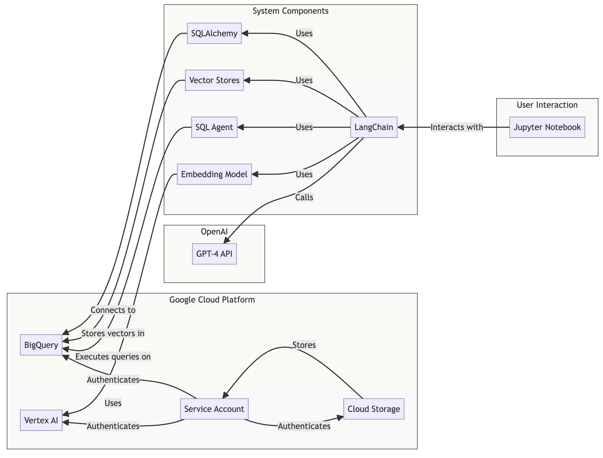
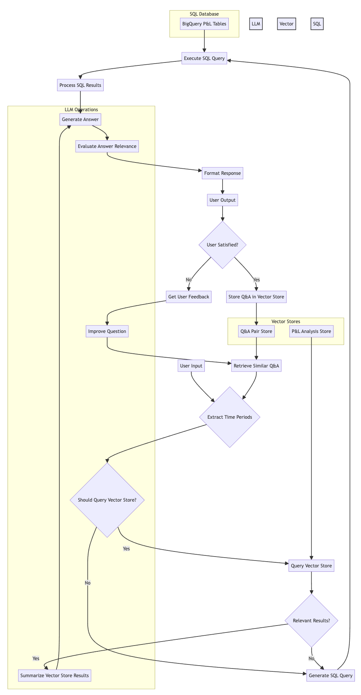

## Readme: Profit & Loss Report Q&A Chatbot using LangChain, LLMs and BigQuery Vector Store

This notebook implements a question-answering system leveraging Large Language Models (LLMs), Langchain, and a vector store in BigQuery to analyze profit and loss (P&L) data. The system allows users to ask natural language questions about the P&L data and receive relevant answers. Note that the P&L analysis referenced in the `pl_reports` table was created using another BigQuery notebook also using LLMs and Langchain, <a href="https://github.com/rittmananalytics/Automated_Profit-Loss_Report_Analyzer_VertexAI">a version of which can be found here</a>.

### System Architecture

The system consists of several key components:



1. **Data Source (BigQuery):** The P&L data resides in BigQuery, organized into tables like `pl_reports`, `profit_and_loss_report_account_group`, etc. Pre-computed analysis is stored in `pl_reports_vector_storage`.

2. **Vector Store (BigQuery):** A BigQueryVectorStore is used to store embeddings of pre-created P&L analysis texts. This allows for efficient similarity search to quickly find relevant context for user questions. The table `pl_reports_vector_storage` holds these embeddings. A separate vector store, `successful_qa_pairs`, is used to store successful question-answer pairs for learning and improving the system's performance.

3. **LLM (OpenAI's GPT-4):** The core intelligence is provided by OpenAI's GPT-4, acting as the question answering engine and providing natural language processing capabilities.

4. **Langchain:** Langchain orchestrates the interaction between the different components. It manages the agent, memory, chains, and toolkits to provide a cohesive and efficient workflow.

5. **SQL Agent (Langchain):** An SQL agent is used to directly query BigQuery when the vector store does not contain sufficient information to answer a question.

6. **Embedding Model (Vertex AI):** `textembedding-gecko@latest` from Google Vertex AI creates vector embeddings of text data, enabling semantic search within the vector store.

### Question Answering Workflow

The process of answering a question follows these steps:



1. **Question Analysis:** The user enters a natural language question.

2. **Vector Store Query (First Attempt):** The system determines whether the question can be answered using the pre-created analysis stored in the `pl_reports_vector_storage` vector store. This is determined by a prompt sent to the LLM, evaluating if the question aligns with the types of analyses performed and the available time range. If deemed suitable, a similarity search is performed to retrieve the most relevant document(s).

3. **Pre-created Answer Summarization:** If relevant documents are found, their content is extracted, stripped of HTML tags, and summarized using the LLM to focus only on information relevant to the question. This avoids providing irrelevant information from the original analysis.

4. **SQL Query (Fallback):** If the vector store query does not yield satisfactory results or is deemed unsuitable, the system uses the Langchain SQL agent. This component uses the LLM to:
- Analyze the question to identify relevant financial terms and entities.
- Translate these terms into a suitable SQL `WHERE` clause to filter the data.
- Construct a SQL query to the appropriate BigQuery view (`profit_and_loss_report_account_group_xa`, `profit_and_loss_report_sub_categories_xa`, or `profit_and_loss_report_categories_xa` depending on the question context). The view selection is determined by analysis of the question.
- Execute the query in BigQuery and format the results into a readable answer.

5. **Answer Relevance Evaluation:** The generated answer (whether from the vector store or SQL query) is evaluated by the LLM to assess its relevance to the original question and provides a relevance score and explanation.

6. **Feedback and Learning:** The user provides feedback on the answer. This feedback is used to improve the question for subsequent iterations, aiming to refine the answer. Successful question-answer pairs are stored in the `successful_qa_pairs` vector store, improving future responses.

7. **Iterative Refinement (Optional):** The system allows for iterative refinement based on user feedback. The LLM is used to reformulate the question in response to feedback, repeating the process for `max_iterations` (default 3).

### Key Functions

* **`ask_question(question, context="")`:** The main function for answering questions. It orchestrates the vector store search and SQL query processes.
* **`should_query_vector_store(question)`:** Determines if a vector store search is likely to provide a relevant answer.
* **`summarize_content(question, content)`:** Summarizes the retrieved vector store content to focus only on relevant information.
* **`find_matching_values(question, lookups)`:** Extracts relevant financial entities from the question to construct the SQL `WHERE` clause.
* **`construct_filter_clause(matches)`:** Creates the SQL `WHERE` clause using extracted entities and time periods.
* **`determine_view(matches)`:** Selects the appropriate BigQuery view based on the question's context.
* **`extract_time_periods(question)`:** Extracts time periods from the question for filtering.
* **`get_similar_qa(question)`:** Retrieves similar Q&A pairs from the `successful_qa_pairs` vector store for context.
* **`ask_question_with_feedback_and_learning(question)`:** Handles user feedback and iterative refinement.
* **`store_successful_qa(question, answer)`:** Stores successful Q&A pairs in the `successful_qa_pairs` vector store.


### Setup and Dependencies

The notebook requires several Python packages, listed at the beginning of the file. Ensure you have installed them before running the code. You will also need to configure:

* A service account key file (`service_account_file`) with access to your BigQuery project.
* An OpenAI API key (`OPENAI_API_KEY`).
* The correct BigQuery project ID, dataset name, and table names.

## Example Output

Example output, with the debugging output removed for clarity, is shown below. The full output including debugging code is <a href="example_output.txt">here</a>.

```
Hi! Ask me a question about our company's profit and loss data

Your question (or type 'QUIT' to exit): What was our revenue in May 2024?

Answer:
Based on the pre-created analysis: The revenue for May 2024 was £137,236.70. This was a significant increase of 101.79% compared to the previous month and was primarily attributed to a new consulting contract with FinCorp Group.

Relevance Evaluation:
Relevance Score: 100%

Explanation: The answer directly addresses the question by providing the exact revenue for May 2024. It also provides additional context about the increase in revenue and the reason for it, which, while not directly asked for, enhances the completeness of the response.

Did this answer your question sufficiently? (yes/no): yes

Final Answer: Based on the pre-created analysis: The revenue for May 2024 was £137,236.70. This was a significant increase of 101.79% compared to the previous month and was primarily attributed to a new consulting contract with FinCorp Group.

Relevance Evaluation:
Relevance Score: 100%

Explanation: The answer directly addresses the question by providing the exact revenue for May 2024. It also provides additional context about the increase in revenue and the reason for it, which, while not directly asked for, enhances the completeness of the response.

---

Your question (or type 'QUIT' to exit): What was our revenue in May 2020?

Answer:
The revenue for May 2020 was £35,030.78.

Did this answer your question sufficiently? (yes/no): no

Please provide feedback on how the answer could be improved: The revenue number needs to be compared to the same month in the previous year, with a percentage change between the month in-question and month a year ago

Answer:
The revenue in May 2020 was £35030.78 and in May 2019 it was £19777.34. The percentage change in revenue from May 2019 to May 2020 is approximately 77.2%.

Did this answer your question sufficiently? (yes/no): yes

---

Your question (or type 'QUIT' to exit): QUIT
```
